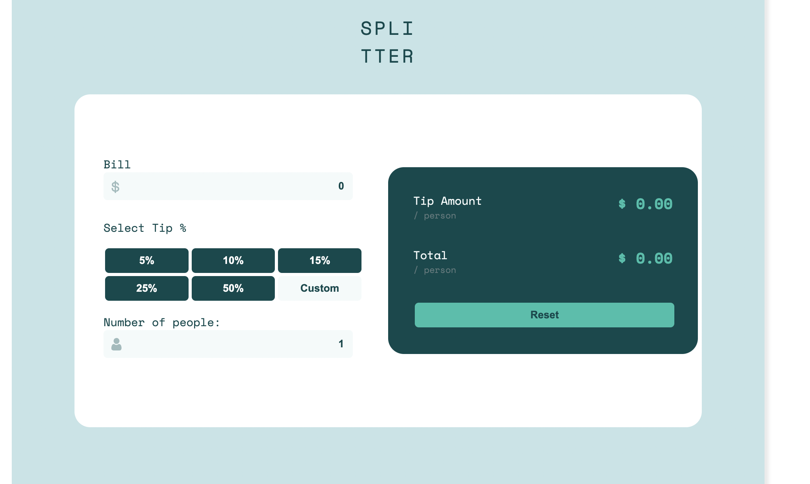

# Frontend Mentor - Tip calculator app solution

This is a solution to the [Tip calculator app challenge on Frontend Mentor](https://www.frontendmentor.io/challenges/tip-calculator-app-ugJNGbJUX). Frontend Mentor challenges help you improve your coding skills by building realistic projects.

## Table of contents

- [Overview](#overview)
  - [The challenge](#the-challenge)
  - [Screenshot](#screenshot)
- [My process](#my-process)
  - [Built with](#built-with)
  - [What I learned](#what-i-learned)
- [Author](#author)

## Overview

### The challenge

Users should be able to:

- View the optimal layout for the app depending on their device's screen size
- See hover states for all interactive elements on the page
- Calculate the correct tip and total cost of the bill per person

### Screenshot

## My process

### Built with

- Semantic HTML5 markup
- CSS custom properties
- Flexbox
- Javascript

### What I learned

With this challenge I was able to reinforce my knowledge of CSS and HTML, and giving interactivity to the application with Javascript

## Author

- Website - [Andres Court](https://www.your-site.com)
- Frontend Mentor - [@alcb1310](https://www.frontendmentor.io/profile/alcb1310)
- Twitter - [@alcb1310](https://www.twitter.com/alcb1310)
- GitHub - [@alcb1310](https://www.github.com/alcb1310)
